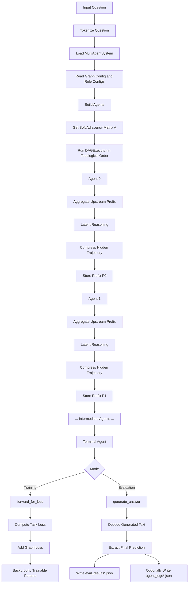
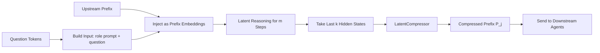
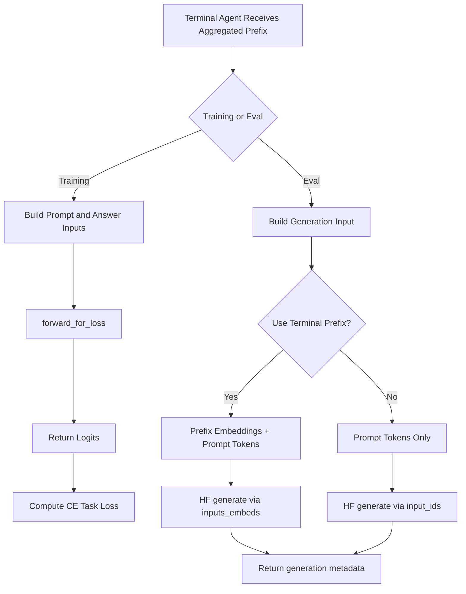
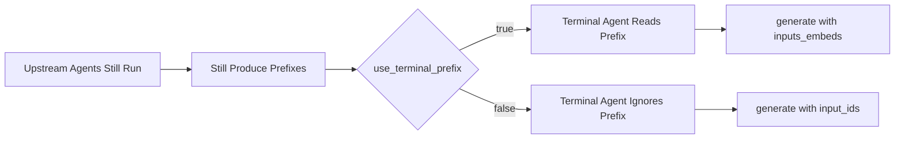
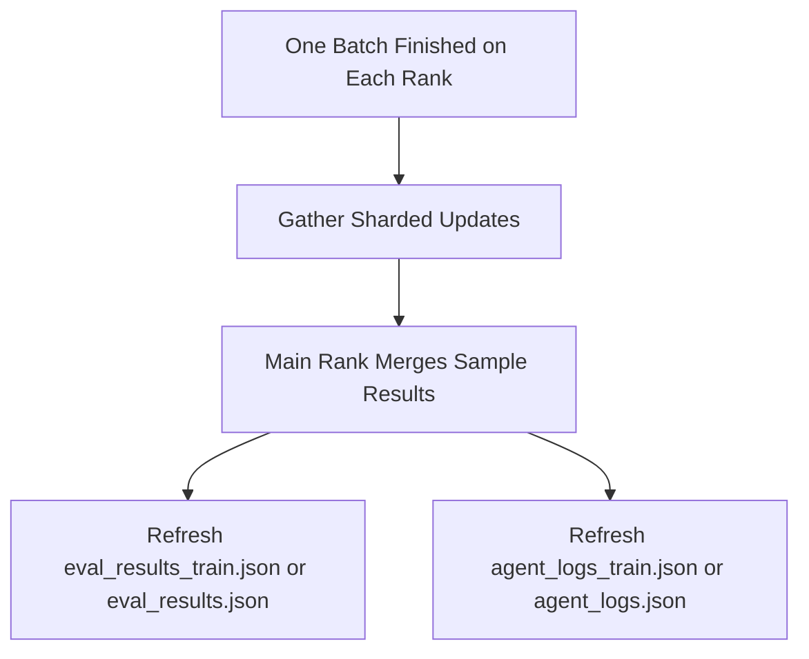

# Ours Agent Workflow

这份文档用 Mermaid 图说明当前 `ours` 方法在训练与评测时的 agent 执行流程，重点标出：

- 多 agent 的串行执行顺序
- 非终端 agent 的 latent reasoning 与 prefix 压缩
- 终端 agent 在 training / eval 下的不同路径
- `use_terminal_prefix` 对最终推理路径的影响

## 1. Overall Workflow



## 2. Non-Terminal Agent Workflow

非终端 agent 的流程是固定的：先读上游 prefix，再做 latent reasoning，最后把 hidden trajectory 压缩成 prefix 传给下游。



对应代码位置：

- [multi_agent_system.py](/blue/buyuheng/chengzhi.ucsb/code/toby/latent-MAS/src/pipeline/multi_agent_system.py)
- [dag_executor.py](/blue/buyuheng/chengzhi.ucsb/code/toby/latent-MAS/src/graph/dag_executor.py)
- [agent.py](/blue/buyuheng/chengzhi.ucsb/code/toby/latent-MAS/src/models/agent.py)

## 3. Terminal Agent Workflow

终端 agent 是最关键的分叉点，因为 training 和 eval 的处理方式不同。



这里需要特别注意：当前版本不再使用旧的“手写逐 token generation loop”。无论有没有 terminal prefix，终端生成最终都委托给 Hugging Face `generate(...)`，差别只在于是走 `inputs_embeds` 还是 `input_ids` 路径。

## 4. `use_terminal_prefix` 的作用

`use_terminal_prefix` 只影响终端 agent，不影响前面非终端 agent 的 latent reasoning。



这意味着：

- 前面 agent 仍然会完整执行
- 区别只在最后一个 agent 是否真的消费聚合 prefix
- `false` 往往更快，因为省掉了 prefix-embedding 拼接分支

## 5. Eval Logging Workflow

当前 `ours eval` 在每个 shard step 完成后，会聚合各 rank 的样本更新，并持续刷新 JSON 结果文件。



常见输出文件是：

- `eval_results_train.json`
- `eval_results.json`
- `agent_logs_train.json`
- `agent_logs.json`

你也可以配合这两份文档一起看：

- [prompt_flow.md](/blue/buyuheng/chengzhi.ucsb/code/toby/latent-MAS/docs/prompt_flow.md)
- [ours_json_log_format.md](/blue/buyuheng/chengzhi.ucsb/code/toby/latent-MAS/docs/ours_json_log_format.md)

## 6. 为什么当前 Eval 会慢

从 workflow 角度看，当前 `ours eval` 慢主要有四层原因：

1. 多个非终端 agent 串行执行。
2. 每个非终端 agent 都要跑 `reasoning_steps`。
3. 终端 agent 在使用 terminal prefix 时需要走 `inputs_embeds` 生成分支。
4. 主进程会持续刷新结果 JSON。

因此总体耗时近似是：

```text
多 agent latent reasoning
+ prefix compression
+ terminal generation
+ gather / JSON refresh
```
