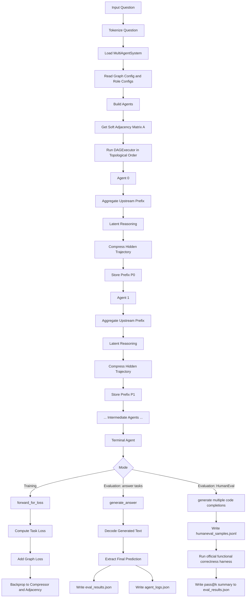
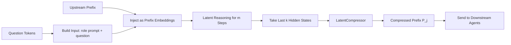
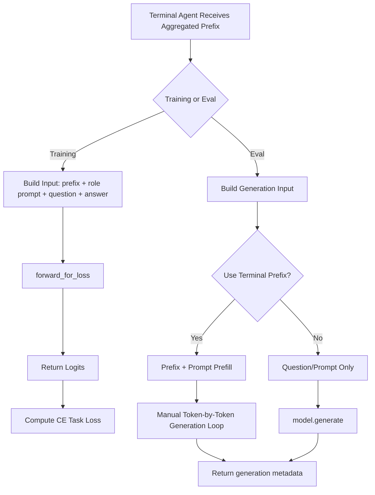
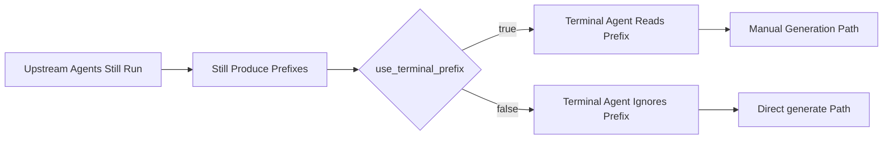
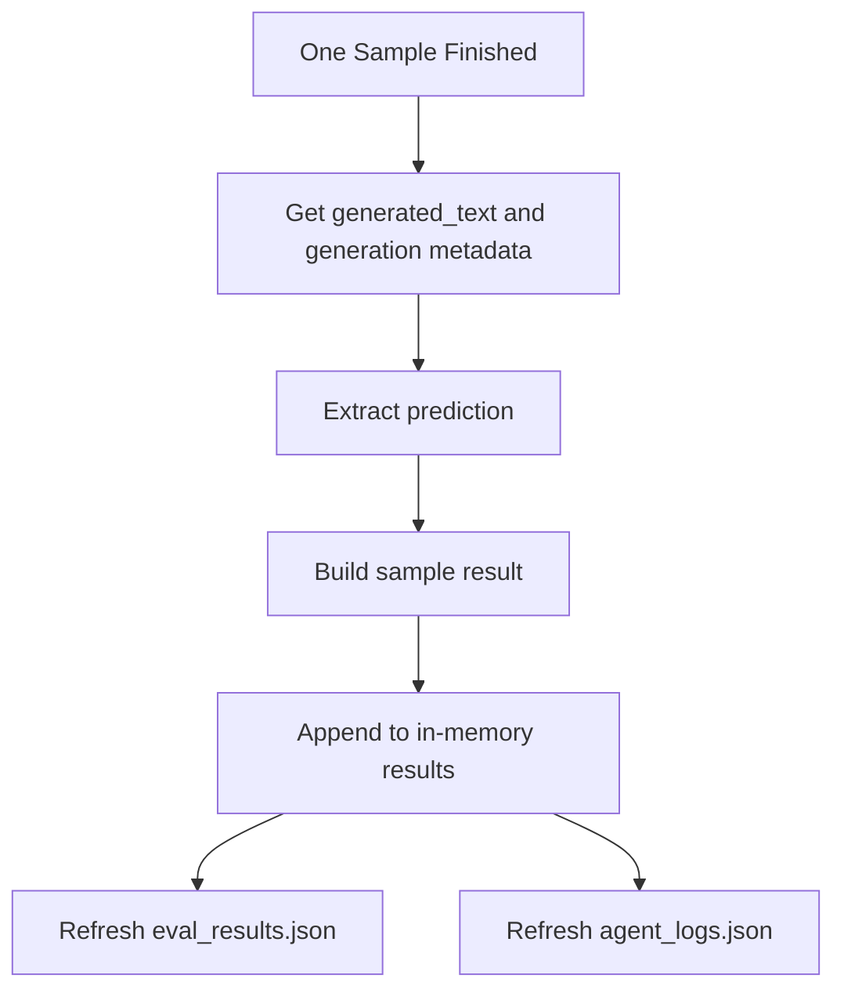

# Ours Agent Workflow

这份文档用 Mermaid 图说明当前 `ours` 方法在训练与评测时的 agent 执行流程，重点标出：

- 多 agent 的串行执行顺序
- 非终端 agent 的 latent reasoning 与 prefix 压缩
- 终端 agent 在 training / eval 下的不同路径
- `--no-terminal-prefix` 对最终推理路径的影响

## 1. Overall Workflow



## 2. Non-Terminal Agent Workflow

非终端 agent 的流程是固定的：先读上游 prefix，再做 latent reasoning，最后把 hidden trajectory 压缩成 prefix 传给下游。



对应代码位置：

- [multi_agent_system.py](/blue/buyuheng/chengzhi.ucsb/code/toby/latent-MAS/src/pipeline/multi_agent_system.py)
- [dag_executor.py](/blue/buyuheng/chengzhi.ucsb/code/toby/latent-MAS/src/graph/dag_executor.py)
- [agent.py](/blue/buyuheng/chengzhi.ucsb/code/toby/latent-MAS/src/models/agent.py)

## 3. Terminal Agent Workflow

终端 agent 是整个系统里最关键的分叉点，因为 training 和 eval 的处理方式不同。



## 4. `--no-terminal-prefix` 的作用

`--no-terminal-prefix` 只影响终端 agent，不影响前面非终端 agent 的 latent reasoning。



这意味着：

- 开启 `--no-terminal-prefix` 时，前面 agent 还是会照常跑
- 只是最后一个 agent 在生成答案时不使用上游 prefix
- 这通常会更快，因为会绕开当前的手写逐 token 生成路径

## 5. Eval Logging Workflow

当前 `ours eval` 的 logging workflow 需要区分两类任务。



这里的两个输出文件分别是：

- `eval_results.json`
- `agent_logs.json`

对于 `humaneval`，主产物会额外变成：

- `humaneval_samples.jsonl`
- `humaneval_problems.jsonl`
- `<samples>.jsonl_results.jsonl`

这条路径的主指标是 `pass@k`，不是逐题 exact-match。

你也可以配合这两份文档一起看：

- [prompt_flow.md](/blue/buyuheng/chengzhi.ucsb/code/toby/latent-MAS/docs/prompt_flow.md)
- [ours_json_log_format.md](/blue/buyuheng/chengzhi.ucsb/code/toby/latent-MAS/docs/ours_json_log_format.md)

## 6. 为什么当前 Eval 会慢

从 workflow 角度看，当前 `ours eval` 慢主要有这几层原因：

1. 多个非终端 agent 是串行执行的，不是并行执行的。
2. 每个非终端 agent 都要做 `m` 步 latent reasoning。
3. 终端 agent 在使用 terminal prefix 时，会走手写逐 token 生成路径。
4. 每条样本结束后都会刷新 JSON 结果文件。

因此当前的总体耗时并不只是“最后生成答案的时间”，而是：

```text
多 agent latent reasoning
+ prefix compression
+ terminal generation
+ logging / JSON refresh
```
